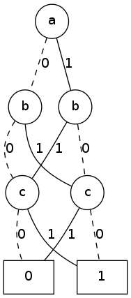
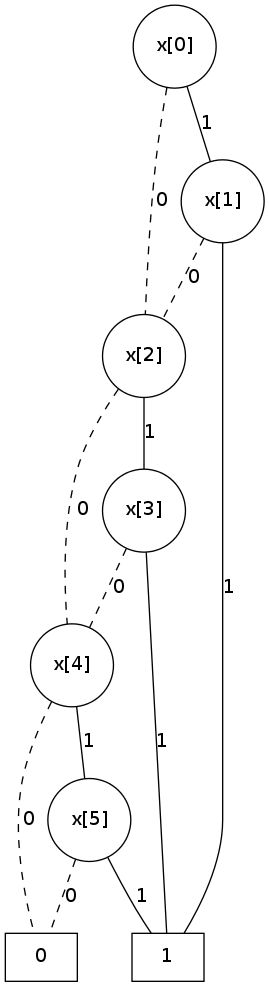
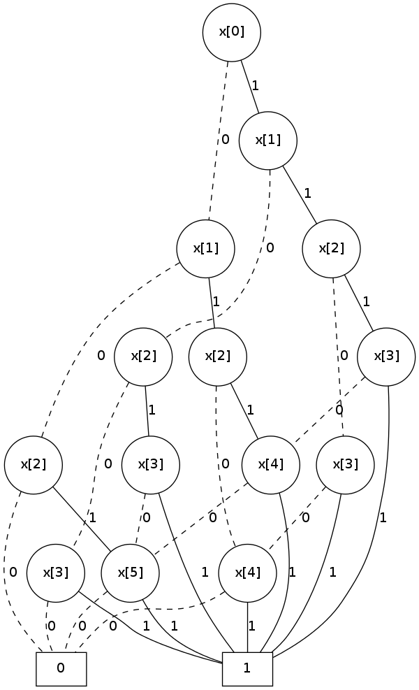

.. _bdd:

****************************
  Binary Decision Diagrams
****************************

A binary decision diagram is a directed acyclic graph used to represent a
Boolean function.
They were originally introduced by Lee [#f1]_,
and later by Akers [#f2]_.
In 1986, Randal Bryant introduced the reduced, ordered BDD (ROBDD) [#f3]_.

The ROBDD is a *canonical* form,
which means that given an identical ordering of input variables,
equivalent Boolean functions will always reduce to the same ROBDD.
This is a very desirable property for determining formal equivalence.
Also, it means that unsatisfiable functions will be reduced to zero,
making SAT/UNSAT calculations trivial.
Due to these auspicious properties, the term BDD almost always refers to some
minor variation of the ROBDD devised by Bryant.

In this chapter,
we will discuss how to construct and visualize ROBDDs using PyEDA.

The code examples in this chapter assume that you have already prepared your
terminal by importing all interactive symbols from PyEDA::

   >>> from pyeda.inter import *

Constructing BDDs
=================

There are two ways to construct a BDD:

1. Convert an expression
2. Use operators on existing BDDs

Convert an Expression
---------------------

Since the Boolean expression is PyEDA's central data type,
you can use the ``expr2bdd`` function to convert arbitrary expressions to BDDs::

   >>> f = expr("a & b | a & c | b & c")
   >>> f
   Or(And(a, b), And(a, c), And(b, c))
   >>> f = expr2bdd(f)
   >>> f
   <pyeda.boolalg.bdd.BinaryDecisionDiagram at 0x7f556874ed68>

As you can see, the BDD does not have such a useful string representation.
More on this subject later.

Using Operators
---------------

Just like expressions, BDDs have their own ``Variable`` implementation.
You can use the ``bddvar`` function to construct them::

   >>> a, b, c = map(bddvar, 'abc')
   >>> type(a)
   pyeda.boolalg.bdd.BDDVariable
   >>> isinstance(a, BinaryDecisionDiagram)
   True

Creating indexed variables with namespaces always works just like expressions::

   >>> a0 = bddvar('a', 0)
   >>> a0
   a[0]
   >>> b_a_0_1 = bddvar(('a', 'b'), (0, 1))
   b.a[0,1]

Also, the ``bddvars`` function can be used to create multi-dimensional arrays
of indexed variables::

   >>> X = bddvars('x', 4, 4)
   >>> X
   farray([[x[0,0], x[0,1], x[0,2], x[0,3]],
           [x[1,0], x[1,1], x[1,2], x[1,3]],
           [x[2,0], x[2,1], x[2,2], x[2,3]],
           [x[3,0], x[3,1], x[3,2], x[3,3]]])

From variables, you can use Python's ``~|&^`` operators to construct arbitrarily
large BDDs.

Here is the simple majority function again::

   >>> f = a & b | a & c | b & c
   >>> f
   <pyeda.boolalg.bdd.BinaryDecisionDiagram at 0x7f556874ed68>

This time, we can see the benefit of having variables available::

   >>> f.restrict({a: 0})
   <pyeda.boolalg.bdd.BinaryDecisionDiagram at 0x7f556874eb38>
   >>> f.restrict({a: 1, b: 0})
   c
   >>> f.restrict({a: 1, b: 1})
   1

BDD Visualization with IPython and GraphViz
===========================================

If you have `GraphViz <http://www.graphviz.org>`_ installed on your machine,
and the ``dot`` executable is available on your shell's path,
you can use the ``gvmagic`` IPython extension to visualize BDDs.

::

   In [1]: %install_ext https://raw.github.com/cjdrake/ipython-magic/master/gvmagic.py

   In [2]: %load_ext gvmagic

For example, here is the majority function in three variables as a BDD::

   In [3]: a, b, c = map(bddvar, 'abc')

   In [4]: f = a & b | a & c | b & c

   In [5]: %dotobj f

.. figure:: image/bdd_majority3.png
   :align: center
   :height: 250px

   BDD of Three-Input Majority Function

The way this works is that the ``%dotobj`` extension internally calls the
``to_dot`` method on ``f``::

   In [6]: f.to_dot()
   'graph BDD {
       n139865543613912 [label=0,shape=box];
       n139865543728208 [label=1,shape=box];
       n139865543169752 [label="c",shape=circle];
       n139865552542296 [label="b",shape=circle];
       n139865543169864 [label="b",shape=circle];
       n139865543170312 [label="a",shape=circle];
       n139865543169752 -- n139865543613912 [label=0,style=dashed];
       n139865543169752 -- n139865543728208 [label=1];
       n139865552542296 -- n139865543613912 [label=0,style=dashed];
       n139865552542296 -- n139865543169752 [label=1];
       n139865543169864 -- n139865543169752 [label=0,style=dashed];
       n139865543169864 -- n139865543728208 [label=1];
       n139865543170312 -- n139865552542296 [label=0,style=dashed];
       n139865543170312 -- n139865543169864 [label=1]; }'

Satisfiability
==============

Like we mentioned in the introduction,
BDDs are a canonical form.
That means that all unsatisfiable functions will reduce to zero,
and all tautologies will reduce to one.
If you simply want to check whether a function is SAT or UNSAT,
just construct a BDD, and test whether it is zero/one.

::

   >>> a, b = map(bddvar, 'ab')
   >>> f = ~a & ~b | ~a & b | a & ~b | a & b
   >>> f
   1
   >>> f.is_one()
   True
   >>> g = (~a | ~b) & (~a | b) & (a | ~b) & (a | b)
   >>> g
   0
   >>> g.is_zero()
   True

If you need one or more satisfying input points,
use the ``satisfy_one`` and ``satisfy_all`` functions.
The algorithm that implements SAT is very simple and elegant;
it just finds a path from the function's root node to one.

::

   >>> a, b, c = map(bddvar, 'abc')
   >>> f = a ^ b ^ c
   >>> f.satisfy_one()
   {b: 0, a: 0, c: 1}
   >>> list(f.satisfy_all())
   [{a: 0, b: 0, c: 1},
    {a: 0, b: 1, c: 0},
    {a: 1, b: 0, c: 0},
    {a: 1, b: 1, c: 1}]

Trace all that paths from the top node to ``1`` to verify.

   BDD of Three-Input XOR Function

Formal Equivalence
==================

Because BDDs are a canonical form, functional equivalence is trivial.

Here is an example where we define the XOR function by using
1) the XOR operator, and 2) OR/AND/NOT operators.

::

   >>> a, b, c = map(bddvar, 'abc')
   >>> f1 = a ^ b ^ c
   >>> f2 = a & ~b & ~c | ~a & b & ~c | ~a & ~b & c | a & b & c

Just like expressions, BDDs have an ``equivalent`` method::

   >>> f1.equivalent(f2)
   True

However, this isn't required.
PyEDA maintains a unique table of BDD nodes and their function pointers,
so you can just test for equality using the Python ``is`` operator::

   >>> f1 is f2
   True

Variable Ordering
=================

The size of a BDD is very sensitive to the order of variable decomposition.
For example, here is a BDD that uses an ideal variable order::

   In [1]: X = bddvars('x', 8)

   In [2]: f1 = X[0] & X[1] | X[2] & X[3] | X[4] & X[5]

   In [3]: %dotobj f1

   Good Variable Ordering

And here is the same function, with a bad variable order::

   In [2]: f2 = X[0] & X[3] | X[1] & X[4] | X[2] & X[5]

   In [3]: %dotobj f2

   Bad Variable Ordering

The previous example was used by Bryant [#f3]_ to demonstrate this concept.
When you think of the definition of a BDD,
it becomes clear why some orderings are superior to others.
What you want in a variable ordering is to decide as much of the function
at every decision level as you traverse towards ``0`` and ``1``.

PyEDA implicitly orders all variables.
It is therefore not possible to create a new BDD by reordering its inputs.
You can, however, rename the variables using the ``compose`` method to achieve
the desired result.

For example, to optimize the previous BDD::

   In [4]: g2 = f2.compose({X[0]: Y[0], X[1]: Y[2], X[2]: Y[4],
                            X[3]: Y[1], X[4]: Y[3], X[5]: Y[5]})

   In [5]: %dotobj g2

   After Variable Renaming

Garbage Collection
==================

Since BDDs are a memory-constrained data structure,
the subject of garbage collection is very important.

PyEDA uses the Python standard library's
`weakref <https://docs.python.org/3/library/weakref.html>`_
module to automatically garbage collect BDD nodes when they are no longer needed.
The BDD function contains a reference to a node,
which contains references to it's children, and so on until you get to zero/one.
When a function's name is either deleted or it goes out of scope,
it may initiate a corresponding cascade of node deletions.

This is best illustrated with an example.
If you look directly into the ``pyeda.boolalg.bdd`` module,
you can find the memory structure that holds BDD nodes::

   >>> from pyeda.boolalg.bdd import _BDDNODES
   >>> len(_BDDNODES)
   2

The table contains two static nodes: zero and one.
Let's define a few variables, and three simple BDDs::

   >>> from pyeda.inter import *
   >>> a, b = map(bddvar, 'ab')
   >>> f1 = a | b
   >>> f2 = a & b
   >>> f3 = a ^ b
   >>> len(_BDDNODES)
   8

Now there are eight nodes.
Let's count the remaining nodes as we delete functions::

   >>> del f1
   >>> len(_BDDNODES)
   7
   >>> del f2
   >>> len(_BDDNODES)
   6
   >>> del f3
   >>> len(_BDDNODES)
   4

References
==========

.. [#f1] C.Y. Lee,
         *Representation of Switching Circuits by Binary-Decision Programs*,
         Bell System Technical Journal, Vol. 38, July 1959, pp. 985-999.

.. [#f2] S.B. Akers,
         *Binary Decision Diagrams*,
         IEEE Transactions on Computers, Vol. C-27, No. 6, June 1978, pp. 509-516.

.. [#f3] Randal E. Bryant
         *Graph-Based Algorithms for Boolean Function Manipulation*,
         IEEE Transactions on Computers, 1986
         http://www.cs.cmu.edu/~bryant/pubdir/ieeetc86.pdf

