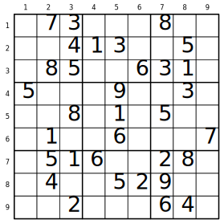

.. sudoku.rst

=================================
  Abusing PyEDA to Solve Sudoku
=================================

According to Peter Norvig in his `fantastic essay <http://norvig.com/sudoku.html>`_
on solving every Sudoku puzzle using Python, security expert
`Ben Laurie <http://en.wikipedia.org/wiki/Ben_Laurie>`_ once stated that
"Sudoku is a denial of service attack on human intellect". I can personally
attest to that.

In this example, I will explain how to misuse/abuse PyEDA's Boolean expressions
and satisfiability engine to create a general-purpose Sudoku solver.

First, let's get a few ground rules straight:

1. There are lots of Sudoku solvers on the Internet; I make no claims of novelty.
2. PyEDA is unlikely to win any speed competitions.
3. Let's face it--this is a pretty awesome waste of time :).

Getting Started
===============

First, import all the standard symbols from pyeda.

::

 >>> from pyeda import *

Let's also define a variable "DIGITS" that makes it easier to access the
Sudoku square values.

::

 >>> DIGITS = "123456789"

Setting Up the Puzzle Grid
==========================

A Sudoko puzzle is a 9x9 **grid**. Each square in the grid may contain any
number in the digits 1-9. The following example grid was generated by
`Web Sudoku <http://www.websudoku.com>`_.

.. _Example_grid:

   Example Sudoku Grid

Let's create a 3-dimensional variable, X, that represents the
state of the grid coordinates. We will keep things
simple by using a multi-dimensional Python list.

::

 >>> X = bitvec("x", 9, 9, 9)

.. NOTE:: Python lists are always indexed from zero, so for this particular
          construction, the variable that corresponds to row 3, column 8,
          value 2 will actually be represented by ``X[2][7][1]``. I realize
          this is confusing, but bear with me.

So for the :ref:`Example_grid`, since row 5, column 3 has value '8', we would
represent this by setting ``X[4][2][7] = 1``.

Constraints
===========

Now that we have a variable ``X[r][c][v]`` to represent the state of the
Sudoku board, we need to program the constraints. We will use the familiar
Boolean 'And' function, and the 'OneHot' function. In case you are not familiar
with the 'OneHot' function, we will describe it here.

One Hot Function
----------------

Let's say I have three variables, **a**, **b**, and **c**.

::

 >>> a, b, c = map(var, "abc")

I want to write a Boolean formula that guarantees that only one of them is
True at any given moment.

::

 >>> f = OneHot(a, b, c)

You can use PyEDA to automatically produce the truth table, in Espresso format.

::

 >>> expr2truthtable(f)
 .i 3
 .o 1
 .ilb a b c
 000 0
 001 1
 010 1
 011 0
 100 1
 101 0
 110 0
 111 0
 .e

By default, the OneHot function returns a formula in product-of-sums form.
Roughly translated, this formula says that "no two variables can both be true,
and at least one must be true".

::

 >>> f
 (a' + b') * (a' + c') * (b' + c') * (a + b + c)

In sum-of-products form, the function looks like this::

 >>> f.to_sop()
 a' * b' * c + a' * b * c' + a * b' * c'

Value Constraints
-----------------

You probably already noticed that if the square at (5, 3) has value '8', it
is not allowed to have any other value.

We will represent this constraint for all squares on the grid using the
following formula::

 >>> V = And(*[
 ...         And(*[
 ...             OneHot(*[ X[r][c][v]
 ...                 for v in range(3 * 3) ])
 ...             for c in range(3 * 3) ])
 ...         for r in range(3 * 3) ])

Roughly translated into English, this formula says that "every square on the
board can assume only one value."

Row and Column Constraints
--------------------------

Next, we need to write formulas that say "every square in each row is
unique", and "every square in each column is unique", respectively.

::

 >>> R = And(*[
 ...         And(*[
 ...             OneHot(*[ X[r][c][v]
 ...                 for c in range(3 * 3) ])
 ...             for v in range(3 * 3) ])
 ...         for r in range(3 * 3) ])
 
 >>> C = And(*[
 ...         And(*[
 ...             OneHot(*[ X[r][c][v]
 ...                 for r in range(3 * 3) ])
 ...             for v in range(3 * 3) ])
 ...         for c in range(3 * 3) ])

Box Constraints
---------------

The box constraints are a little tricker. We need a formula that says "every
square in a box is unique". The key to understanding how to write this formula
is to think of the grid as consisting of 3x3 boxes. Now instead of iterating
over the nine squares in a row or column, we will iterate over the 3 rows and
3 columns of the 3x3 boxes.

::

 >>> B = And(*[
 ...         And(*[
 ...             OneHot(*[ X[3*br+r][3*bc+c][v]
 ...                 for r in range(3) for c in range(3) ])
 ...             for v in range(3 * 3) ])
 ...         for br in range(3) for bc in range(3) ])

Putting It All Together
-----------------------

Now that we have the value, row, column, and box constraints, we need to
combine them all into a single formula. We will use the And function to join
the constraints, because all constraints must be true for the puzzle to be
solved.

Instead of using the 'And' constructor, which will create a new logic
expression, we will instead use the 'CNF_And' function. The reason for this
is simply speed. By now we have a *massive* logic expression that is written
in conjunctive normal form, so we will use the pyeda.cnf.ConjNormalForm data
type to represent the final equation, because it will be smaller and faster
when we kick off the SAT solver.

::

 >>> S = CNF_And(V, R, C, B)
 >>> len(S.clauses)
 10530

As you can see, the constraints formula is *quite* large.

Preparing the Input
===================

We now have the generic constraints for the rules of Sudoku, but when you
sit down to solve a puzzle, you are always given a set of known values. These
are the *inputs*, and they will further constrain the solution.

Here is a function to parse an input string, and produce the input constraints.
Any character in the set 1-9 will be taken as an assignment, the values '0' and
'.' (period) will be taken as an unknown, and all other characters will be
ignored. This function also returns a CNF data type.

::

 >>> def parse_grid(grid):
 ...     chars = [c for c in grid if c in DIGITS or c in "0."]
 ...     assert len(chars) == (3 * 3) ** 2
 ...     I = And(*[ X[i // (3 * 3)][i % (3 * 3)][int(c) - 1]
 ...                for i, c in enumerate(chars) if c in DIGITS ])
 ...     return expr2cnf(I)

The example grid above could be written like this::

 >>> grid = ( ".73|...|8.."
 ...          "..4|13.|.5."
 ...          ".85|..6|31."
 ...          "---+---+---"
 ...          "5..|.9.|.3."
 ...          "..8|.1.|5.."
 ...          ".1.|.6.|..7"
 ...          "---+---+---"
 ...          ".51|6..|28."
 ...          ".4.|.52|9.."
 ...          "..2|...|64." )

Display Methods
===============

To display the solution, we will need some methods. The PyEDA SAT solver
returns a dictionary that represents a "point" in an N-dimensional Boolean
space. That is, it maps N Boolean variables (in our case 729) onto their
values in {0, 1}.

::

 >>> def get_val(point, r, c):
 ...     for v in range(3 * 3):
 ...         if point[X[r][c][v]]:
 ...             return DIGITS[v]
 ...     return "X"
 
 >>> def display(point):
 ...     chars = list()
 ...     for r in range(3 * 3):
 ...         for c in range(3 * 3):
 ...             if c != 0 and c % 3 == 0:
 ...                 chars.append("|")
 ...             chars.append(get_val(point, r, c))
 ...         if r != (3 * 3 - 1):
 ...             chars.append("\n")
 ...             if r % 3 == (3 - 1):
 ...                 chars.append("+".join(["-" * 3] * 3) + "\n")
 ...     print("".join(chars))

Finding the Solution
====================

Without further do, let's use PyEDA's built-in DPLL SAT solver to crunch the
numbers.

::

 >>> def solve(grid):
 ...     I = parse_grid(grid)
 ...     cnf = I * S
 ...     return cnf.satisfy_one()

Here is the solution to the :ref:`Example_grid`::

 >>> display(solve(grid))
 173|529|864
 694|138|752
 285|476|319
 ---+---+---
 567|294|138
 428|713|596
 319|865|427
 ---+---+---
 951|647|283
 846|352|971
 732|981|645

That example was actually a pretty easy puzzle. Let's see how the Sudoku
solver handles a few harder puzzles.

::

 >>> grid = ( "6..|3.2|..."
 ...          ".5.|...|.1."
 ...          "...|...|..."
 ...          "---+---+---"
 ...          "7.2|6..|..."
 ...          "...|...|.54"
 ...          "3..|...|..."
 ...          "---+---+---"
 ...          ".8.|15.|..."
 ...          "...|.4.|2.."
 ...          "...|...|7.." )
 
 >>> display(solve(grid))
 614|382|579
 953|764|812
 827|591|436
 ---+---+---
 742|635|198
 168|279|354
 395|418|627
 ---+---+---
 286|157|943
 579|843|261
 431|926|785
 
 >>> grid = ( "38.|6..|..."
 ...          "..9|...|..."
 ...          ".2.|.3.|51."
 ...          "---+---+---"
 ...          "...|..5|..."
 ...          ".3.|.1.|.6."
 ...          "...|4..|..."
 ...          "---+---+---"
 ...          ".17|.5.|.8."
 ...          "...|...|9.."
 ...          "...|..7|.32" )
 
 >>> display(solve(grid))
 385|621|497
 179|584|326
 426|739|518
 ---+---+---
 762|395|841
 534|812|769
 891|476|253
 ---+---+---
 917|253|684
 243|168|975
 658|947|132
